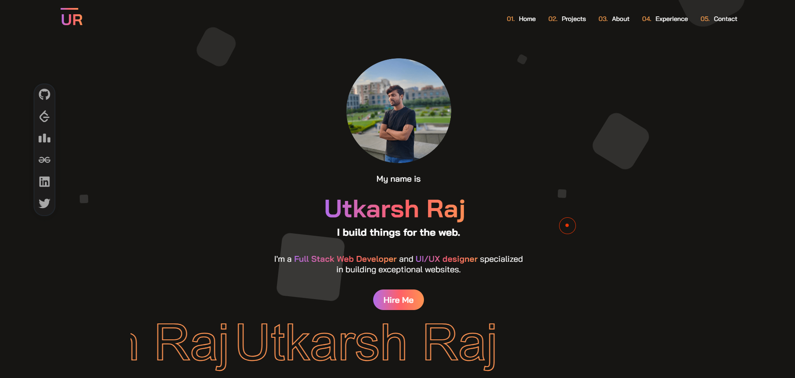

<div align="center">
  
</div>

<h1 align="center">
  Utkarsh Raj
</h1>

<p align="center">
  The first iteration of <a href="https://utkarsh-raj13.netlify.app/" target="_blank">utkarshraj.in</a> built with <a href="https://react.dev/" target="_blank">React</a>, <a href="https://firebase.google.com/" target="_blank">Firebase</a>, <a href="https://vitejs.dev/guide/" target="_blank">Vite</a> and hosted with <a href="https://www.netlify.com/" target="_blank">Netlify</a>
</p>



## 🚨 Forking this repository

I appreciate the interest many of you have shown in using my code for your own websites. Generally, my answer is **yes, you can use it, with proper attribution**.

Keeping my site open source is important to me, but as we all know, _**plagiarism is unacceptable**_. It’s disheartening to see my work copied without any credit. I’ve put significant effort into building and designing this version of my website, and I take pride in it.

All I ask is that you acknowledge my work and not present it as your own. Thank you for respecting this request.

Yes, you can fork this repo. Please give me proper credit by linking back to [https://utkarsh-raj13.netlify.app/](https://utkarsh-raj13.netlify.app/). Thanks!

## 🍴 Forking and Cloning Repo

First fork this repo and then clone it to your local system

```sh
git clone https://github.com/{your_github_username}/portfolio-updated.git
```

## 🛠 Installation & Set Up

1. Install and use the correct version of Node using [NVM](https://github.com/nvm-sh/nvm)

   ```sh
   nvm install
   ```

2. Install dependencies

   ```sh
   npm i
   ```

3. Start the development server

   ```sh
   npm run dev
   ```

## ⚙️ Update changes

- Go to the `src/data.js` and change the data according to your profile

- Setup you own [Firebase](https://console.firebase.google.com/u/0/) in `src/firebaseConfig.js`
